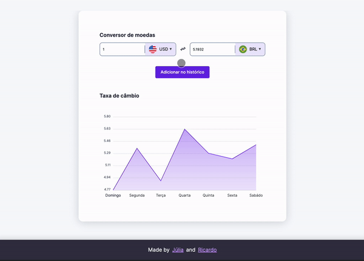
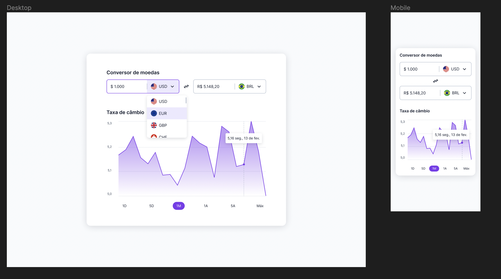

<h1 align="center"> #9 Currency Converter </h1>

Criação de um conversor de moedas é o #9 desafio <a href="https://boracodar.dev/">#BORACODAR</a> da RocketSeat 

  <a href="#-tecnologias">Tecnologias</a>&nbsp;&nbsp;&nbsp;|&nbsp;&nbsp;&nbsp;
  <a href="#-projeto">Projeto</a>&nbsp;&nbsp;&nbsp;|&nbsp;&nbsp;&nbsp;
  <a href="#-layout">Layout</a>&nbsp;&nbsp;&nbsp;|&nbsp;&nbsp;&nbsp;
  <a href="#-collaborators">Collaborators</a>&nbsp;&nbsp;&nbsp;|&nbsp;&nbsp;&nbsp;

 

  

## 🚀 Tecnologias

Esse projeto foi desenvolvido com as seguintes tecnologias:

- HTML
- CSS
- JavaScript
- React
- Git e Github
- Figma
- ApexCharts

## 💻 Projeto

O projeto _Currency Converter_ foi realizado como parte do #9 desafio #BORACODAR da RocketSeat sugerido pelo professor <a href="https://github.com/maykbrito" alt="Link para o GitHub do professor Mayk Brito" target="_blank">Mayk Brito</a>.

<h1 align="center">
  Funcionalidades
</h1>

O desafio inicial foi a criação de um conversor de moedas como o modelo mostrado em <a href="#-layout-figma">Layout</a>, após a confecção do modelo, criamos a funcionalidade de adicionar a conversão no histórico, assim, gerando o gráfico.

<h2 align="center">
  Página Inicial
</h2>

Na página inicial é possível usar a funcionalidade de fazer a conversão de moedas de alguns países (a cotação foi pega do dia que o desafio foi feito).

Entre os inputs de conversão, há um ícone com as duas flexas, clicando nele é possível inverter o resultado.

Por fim, clicando no botão "Adicionar no histórico" é possível gerar o histórico que é mostrado no gráfico, o valor do segundo input é pego e é aleatoriamente multiplicado por valores entre 0.9 e 1.2 para cada um dos dias.

_<h2 align="center" ><a href="https://currency-converter-rocketseat.vercel.app" target="_blank">Visite o projeto online</a></h2>_

## 🔖 Layout

Você pode visualizar o layout proposto pela RocketSeat através do da <a href="#-layout-figma">imagem abaixo</a>. Disponibilizado pelo [Figma](https://figma.com) durante o período do desafio.

  

## 📃 Collaborators

This challange was made by [Julia](https://gsajulia.github.io) and [Ricardo](https://rickazuo.github.io/portfolio/)
